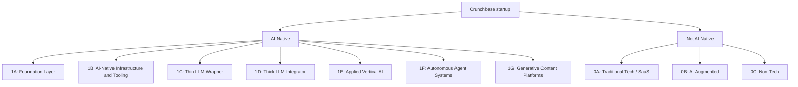

# AI-Native Startup Taxonomy

Research code for a two-axis taxonomy of startups, built while I was an AI student researcher at the University of British Columbia. The companion paper is [Prompted to Start: How Generative AI is Transforming Entrepreneurship](https://papers.ssrn.com/sol3/papers.cfm?abstract_id=5749564).

Each company gets an AI-native subclass and a Resource-Adjusted AI Dependency (RAD) score. RAD asks whether the company could still ship a competitive product without current third-party foundation-model APIs, given its funding and its own models or data.

## Taxonomy

AI-native companies are 1A through 1G. The other three are 0A, 0B, and 0C. RAD is `RAD-H`, `RAD-M`, `RAD-L`, or `RAD-NA` when the company is not AI-native. `RAD-H` means the product stays tied to someone else's model API. `RAD-L` means the company trains its own models, or could keep the product if those APIs went away.

## Commands

Production scoring is `python -m two_pass_classifier`. Pass A decides AI-native or not and keeps token log probabilities. Pass B assigns the subclass and the RAD score. The model sees website text plus Crunchbase fields. It does not see whether the company is alive.

| Command | What it does |
|---------|----------------|
| `build-manifest` | Freeze the company list a run will score. Offline. |
| `cost-preview` | Price that list before any API call. |
| `smoke` | Score 10 companies with the real requests. |
| `run` | Score the full list after that smoke matches. |
| `status RUN_ID` | Read progress from the local journal. |
| `resume RUN_ID` | Continue a run that stopped. |
| `retry RUN_ID` | Ask for another attempt on rows that can be retried. |

`build-manifest --live` is the path to the live-website CSV. It is not a switch that spends money.

Website text comes from two other commands. `python -m tavily_crawler liveness` checks which homepages still answer. `python -m tavily_crawler crawl --live` pulls pages from those sites. Without `--live`, the crawl exits 2.

Archive text lives under `wayback_machine/`. `run_extract.py --live` pulls a March 2023 page. `run_extract_dead.py --live` pulls a page from before a missed company went offline. Both exit 2 without `--live`. The classifier commands in that folder also exit 2. Score the resulting CSV with `two_pass_classifier`.
